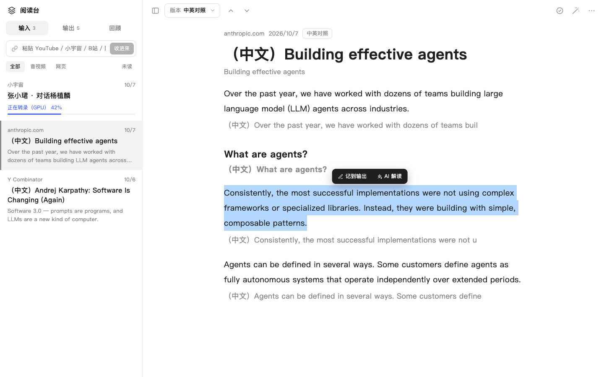
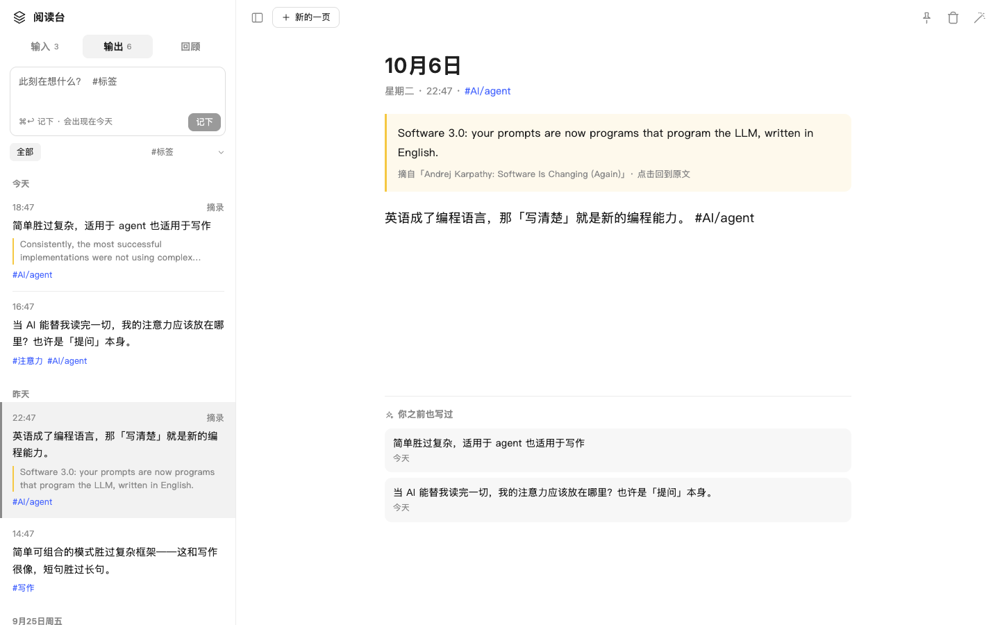
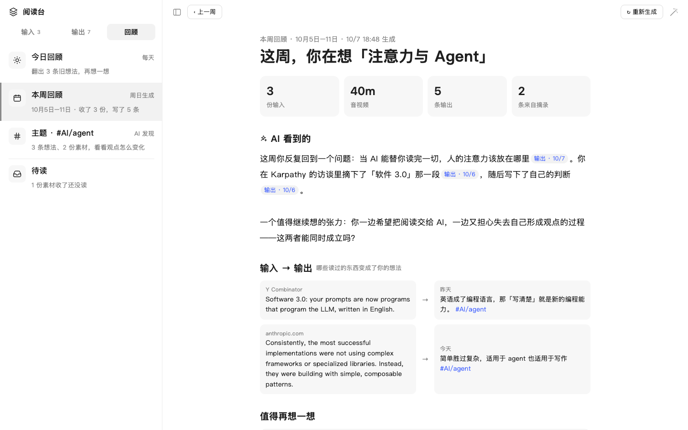

# Reverie · dsh-reverie

**中文** · [English](#english)

[DeepSeek Harness](https://github.com/deepseek-ai/deepseek-harness) 的读书笔记插件：把链接扔进来，自动转录或抓取正文，中英对照精读；随手写下想法；再按天、按周、按主题回顾。全程可以让 AI 解读、陪你对话。

这是个人开发的社区插件，不是 DeepSeek 官方插件，也和乔木 RSS 没有隶属关系。部分代码改编自 [乔木 RSS · qiaomu-rss-dsh](https://github.com/joeseesun/qiaomu-rss-dsh)（GPL-3.0-only），详见 [致谢与许可](#致谢与许可)。



> 截图来自早期开发版本，当时插件名为「阅读台」，界面与当前版本基本一致。

## 能做什么

左栏分三块：

- **输入**：粘贴链接就行。
  - YouTube、B 站、小宇宙单集、Spotify 和苹果播客单集、音视频直链：在本机转录。YouTube 有人工字幕时直接用字幕；没有就用 yt-dlp 下载音频，再用本机 Whisper 转录（Apple 芯片用 mlx-whisper，否则用 faster-whisper）。
  - Spotify 的音频是加密的，不能直接下载。Reverie 会读取这期节目的标题和节目名，到 Apple Podcasts 公开目录和节目的 RSS 里找到同一期的公开音频再转录；Spotify 独家节目没有公开音频，会提示换成其他平台的链接。
  - 网页：抓取正文。
  - 小红书笔记、公众号文章、推特推文：抓取正文和图片（推文走 vxtwitter，失败时退回官方 syndication 接口；小红书需要 App「分享 → 复制链接」得到的新链接）。带视频的帖子会再把音轨转录出来。
  - 列表可以按「全部 / 音视频 / 网页 / 小红书 / 公众号 / 推特」筛选。
  - 外文内容自动翻成中文。阅读页的「版本」可以切换中英对照、中文、原文。
  - 音视频带播放器，每段有时间戳，点一下就跳到那里。
  - 选中一段文字，可以「记到输出」，也可以「AI 解读」。
  - 魔法棒按钮打开「AI 伴读」，用的是 Harness 原生对话，AI 会自动看到你正在读的内容。
  - 插件里发起的对话都放在单独的「Reverie」工作区（文件夹 `~/Reverie`），不会混进其他工作区；在 Harness 左侧会话列表里也能找到。
- **输出**：日记本、flomo 和备忘录合在一起。
  - 左栏顶部随手记，可以打 #标签（支持 `#父/子`）。下面按日期分组，可以按标签筛选。
  - 中间是一页一页的编辑区，自动保存。摘录会带着原文，点一下就回到原文那一段。页面底部列出「你之前也写过」的相关想法。
  - 也可以和 AI 对话，帮你追问、展开、找联系。
- **回顾**：
  - **今日回顾**：每天翻出 3 条旧想法，可以「接着写一条」。
  - **本周回顾**：本周统计，加上 AI 写的周总结。总结里每句都标了出处，点了能跳转。另外还有「输入 → 输出」、值得再想一想的旧想法和待读。打开时自动生成，周日晚上自动补全整周，可以翻看上一周。
  - **主题**：按 #标签 串起时间线，由 AI 看你的观点怎么变化。
  - **待读**：收进来但还没读的素材。

**Agent 工具**：`reader_ingest`（扔链接）、`reader_add_memo`（记一条）、`reader_search`、`reader_read_item`。在 Harness 主对话里也能往 Reverie 里扔东西。

| 输出 | 本周回顾 |
| --- | --- |
|  |  |

## 安装

需要 DeepSeek Harness 0.2.0-rc.2（Desktop 或 `dsh` CLI）。

**方式一：Release 安装包（推荐）**

到 [Releases](https://github.com/Gniy7Ga/dsh-reverie/releases/latest) 下载 `dsh-reverie-<版本>.tgz` 和同名 `.sha256`，在下载目录执行：

```bash
shasum -a 256 -c dsh-reverie-0.6.0.tgz.sha256
dsh plugin --profile desktop add "$PWD/dsh-reverie-0.6.0.tgz"
```

用命令行 Web 界面时把 `desktop` 换成 `web`。装好后重启 Harness，在侧边栏打开「Reverie」。也可以在 Harness 对话里把 `.tgz` 的绝对路径交给 Agent，让它用插件管理安装。

**方式二：直接从 GitHub 安装**

仓库里提交了构建好的 `lib/`，不需要在安装时构建：

```bash
dsh plugin --profile desktop add github:Gniy7Ga/dsh-reverie#v0.6.0
```

**从旧包 `my-reader-dsh` 升级**：先在插件管理里移除 `my-reader-dsh`（两者注册了同名的 Agent 工具，不能同时启用），再安装 `dsh-reverie`。第一次启动时会把 `storages/my-reader/` 里的数据复制到 `storages/reverie/`，旧目录保留不动。

### 本机转录环境（可选）

只读网页和带字幕的 YouTube 不需要额外安装。转录音视频需要：

- `yt-dlp` 和 `ffmpeg`：插件会在 `/opt/homebrew/bin`、`/usr/local/bin`、`~/.local/bin`、`/usr/bin` 里找，例如 `brew install yt-dlp ffmpeg`。
- 一个装了 `mlx-whisper`（Apple 芯片）或 `faster-whisper` 的 Python 环境。

插件会自动识别 [AI-Video-Transcriber](https://github.com/wendy7756/AI-Video-Transcriber) 的安装目录（`~/Documents/Codex/*/*/AI-Video-Transcriber`）。其他位置可以在 profile 的 `cordis.patch.yml` 里指定：

```yaml
- id: reverie
  name: dsh-reverie
  config:
    toolchain:
      ytDlp: /opt/homebrew/bin/yt-dlp
      ffmpeg: /opt/homebrew/bin/ffmpeg
      # 二选一：
      mlxPython: /path/to/venv/bin/python
      mlxModel: /path/to/whisper-large-v3-mlx       # 含 weights.npz 或 weights.safetensors 的目录
      fasterWhisperPython: /path/to/venv/bin/python
      fasterWhisperHfHome: /path/to/huggingface-cache  # 可选
```

`config.chatWorkspaceDir` 可以改 Reverie 工作区所在的父目录（默认是用户主目录）。

## 数据

数据保存在 Harness home 的 `storages/reverie/`：`library.json` 存索引、笔记和设置，`bodies/` 存正文。不会上传到别处；翻译和 AI 对话用的是 Harness 当前配置的模型。

## 开发

需要 Node.js 22+ 和 pnpm。

```bash
git clone https://github.com/Gniy7Ga/dsh-reverie.git
cd dsh-reverie
pnpm install
pnpm run build      # 生成 lib/ 和 THIRD_PARTY_LICENSES.md
pnpm test           # 离线测试（假模型）
DSH_HOME=/tmp/reverie-e2e node tests/e2e.mjs   # 联网 + 本机转录的端到端测试
pnpm pack
```

`src/` 是源码，`lib/` 是构建产物，和源码一起提交，DSH bundle 直接加载它。改了源码请重新构建，并把更新后的 `lib/` 一起提交。包名 `dsh-reverie` 必须和 `cordis.patch.yml` 里的 `name` 一致。

## 致谢与许可

- 本项目以 [GPL-3.0-only](LICENSE) 发布。Copyright (C) 2026 Ag ([@Gniy7Ga](https://github.com/Gniy7Ga))。
- 部分代码改编自 [乔木 RSS · qiaomu-rss-dsh](https://github.com/joeseesun/qiaomu-rss-dsh)（作者 向阳乔木，GPL-3.0-only），包括 XML 解析、HTML 清洗、Markdown 渲染、原生对话桥接、YouTube 播放器和 AI 伴读的对话挂载方式；阅读界面的布局也参考了乔木 RSS。因为使用了 GPL-3.0-only 的代码，本项目同样采用 GPL-3.0-only。每个改编文件的来源和改动见 [NOTICE.md](NOTICE.md) 和文件开头的注释。感谢向阳乔木开源乔木 RSS。
- 图标路径来自 [Lucide](https://lucide.dev)（ISC / MIT），推特 token 公式来自 [react-tweet](https://github.com/vercel/react-tweet)（MIT），打包进 `lib/` 的 npm 包见 [THIRD_PARTY_LICENSES.md](THIRD_PARTY_LICENSES.md)。
- 抓取第三方平台内容时请遵守各平台的服务条款和版权要求，仅供个人学习与研究。

问题和建议请提交到 [Issues](https://github.com/Gniy7Ga/dsh-reverie/issues)。

---

<a id="english"></a>

## English

Reverie is a reading-and-notes plugin for DeepSeek Harness. Paste a link (YouTube, Bilibili, Xiaoyuzhou, Apple Podcasts, media files, web pages, Xiaohongshu, WeChat articles, X/Twitter) and it is transcribed locally with Whisper or extracted to clean text, then translated for side-by-side Chinese/English reading. Write flomo-style notes with #tags, and review them by day, week, or theme with AI summaries. A native Harness conversation can sit beside whatever you are reading. Agent tools: `reader_ingest`, `reader_add_memo`, `reader_search`, `reader_read_item`.

This is an independent community plugin, not affiliated with or endorsed by DeepSeek or Qiaomu RSS. Install the release tarball with `dsh plugin --profile desktop add /absolute/path/to/dsh-reverie-0.6.0.tgz`, or `dsh plugin --profile desktop add github:Gniy7Ga/dsh-reverie#v0.6.0` (built `lib/` is committed), then restart Harness. Data lives under `storages/reverie/` in the Harness home.

Licensed under [GPL-3.0-only](LICENSE). Parts of the code are adapted from [qiaomu-rss-dsh](https://github.com/joeseesun/qiaomu-rss-dsh) by 向阳乔木 (joeseesun), GPL-3.0-only; the reading layout is modelled on Qiaomu RSS. Every adapted file, its upstream source, and the changes made are listed in [NOTICE.md](NOTICE.md) and in each file's header. Icon paths come from Lucide (ISC/MIT); bundled npm packages are listed in [THIRD_PARTY_LICENSES.md](THIRD_PARTY_LICENSES.md).
